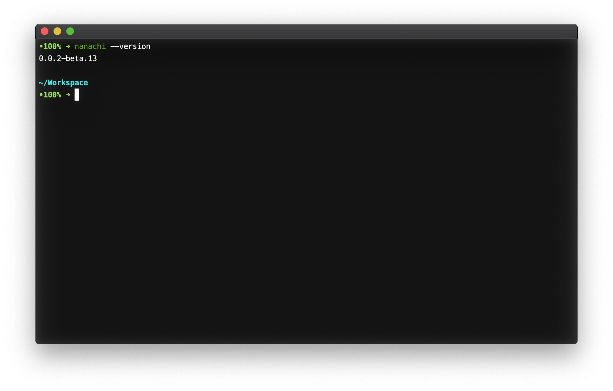
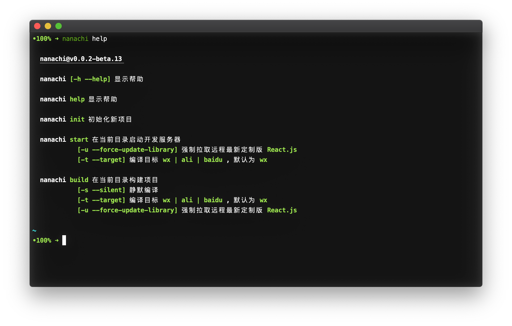
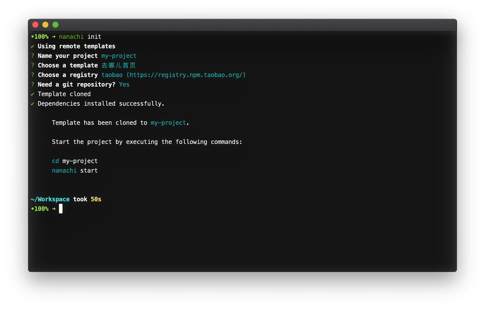
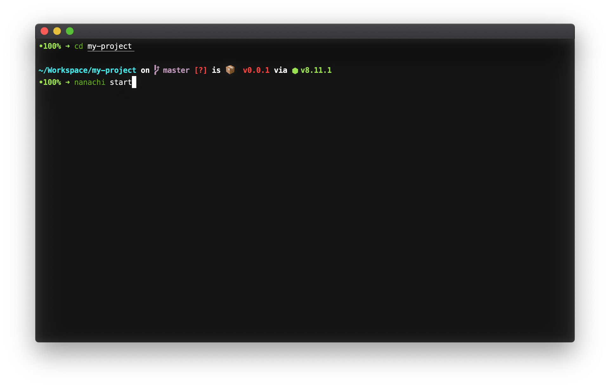
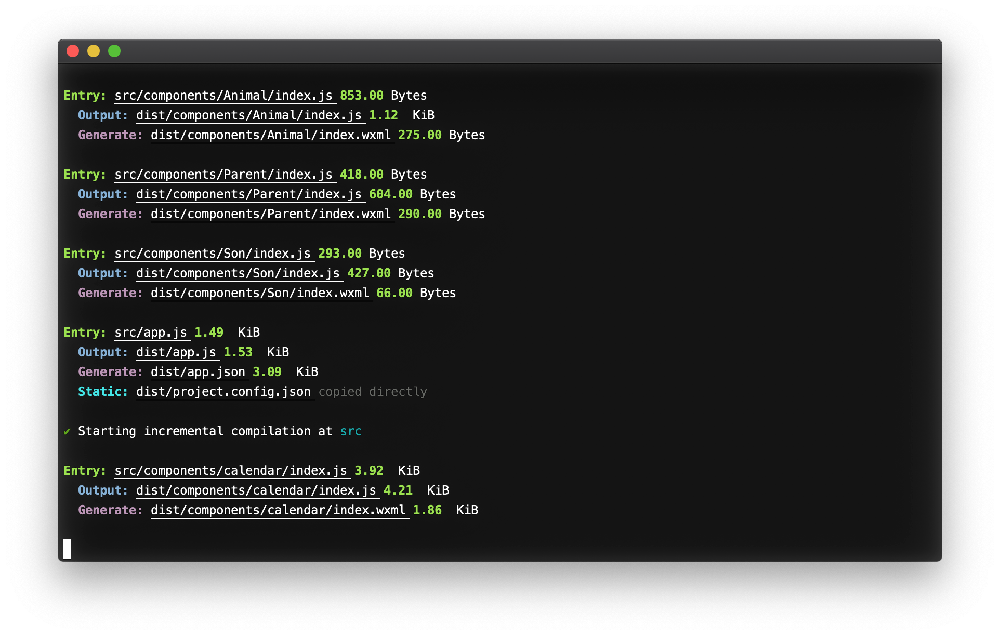
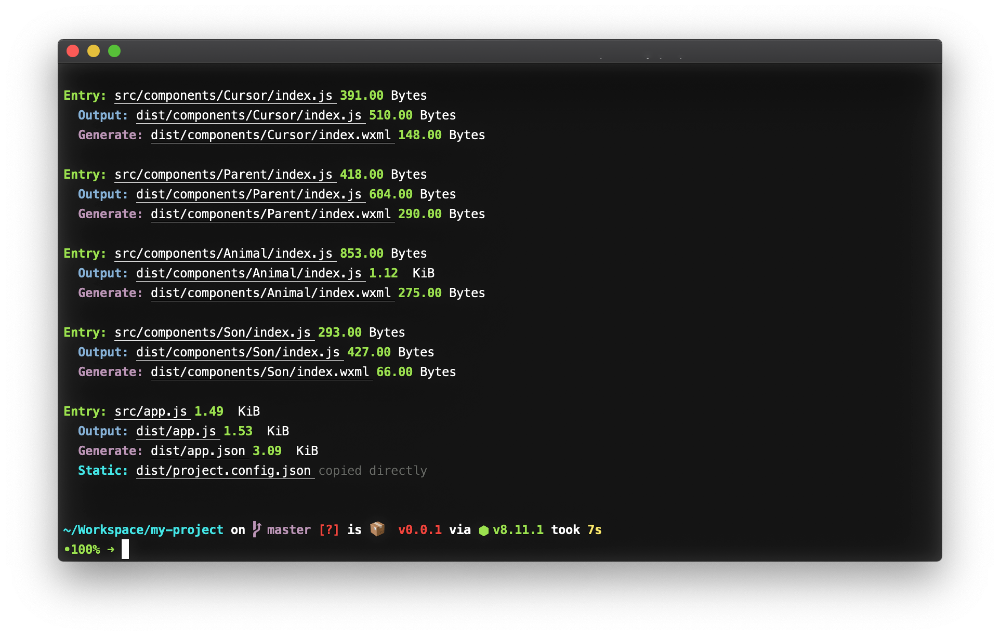
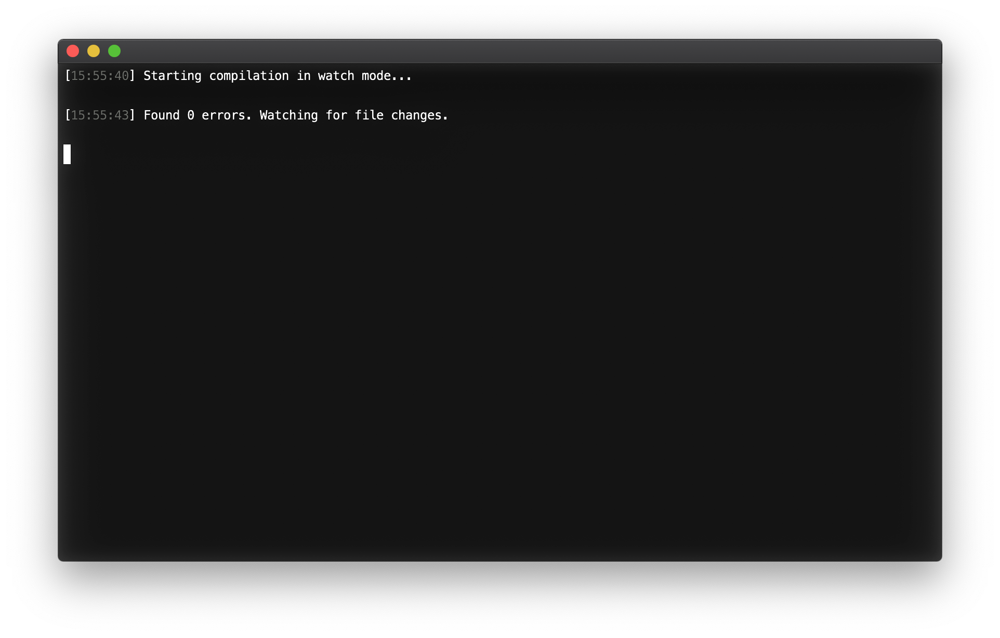
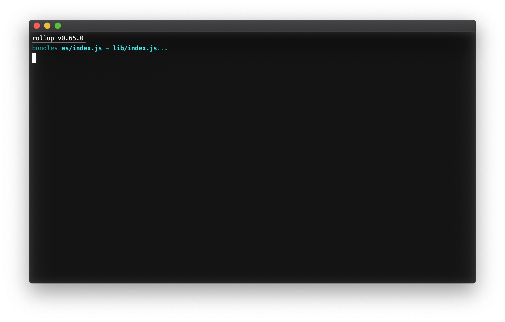

# nanachi-cli

`nanachi-cli` 是 [anu](https://github.com/RubyLouvre/anu/) React 小程序转译的第三方命令行工具。`nanachi-cli` 中的转译相关代码以及浏览器的 `runtime` 库文件均来自 [anu](https://github.com/RubyLouvre/anu/)。

## 使用

执行 `npm i -g nanachi` 以全局安装 `nanachi`。安装完以后执行 `nanachi --version` 查看是否安装成功。如果出现类似以下的版本号则表示安装成功。



执行 `nanachi help` 或者 `nanachi -h` 或者 `nanachi --help` 可以查看帮助。



执行 `nanachi init` 初始化一个项目。



在项目根目录执行 `nanachi start` 开发应用程序。

参数 `[-u --force-update-library]`

- **类型** `boolean`
- **默认值** `false`
- **说明** 是否强制从远程仓库拉取最新版 `runtime` 库文件。

参数 `[-t --target]`

- **类型** `string`
- **默认值** `wx`
- **说明** 编译目标
- **可选值**
  - `wx` 微信小程序
  - `ali` 支付宝小程序
  - `baidu` 百度智能小程序



初始编译之后会进入增量编译模式。



在项目根目录执行 `nanachi build` 编译项目。

参数 `[-u --force-update-library]` 以及参数 `[-t --target]` 与 `start` 命令一致。

参数 `[-s --silent]`

- **类型** `boolean`
- **默认值** `false`
- **说明** 是否开启静默编译。静默编译模式下，不会有任何日志输出。



## 开发指南

在项目目录依次执行以下命令：

```sh
npm i
# 将仓库中的 bin/index.js 链接至全局
npm link

npm run dev:ts
# 新开一个终端
npm run dev:js

# 如果安装了 yarn
yarn
yarn link

yarn run dev:ts
# 新开一个终端
yarn run dev:js
```

顺利的话你会看到两个终端分别是这样的：

`npm run dev:ts` 正在监控 `src/` 目录下的文件改动并编译至 `es/` 目录下。



`npm run dev:js` 正在监控 `es/` 目录下的文件改动并编译至 `lib/index.js`。



正常情况下，执行 `npm link` 或者 `yarn link` 之后，`nanachi` 命令指向的是开发目录下的 `bin/index.js`，该文件只有一行，即导出 `lib/index.js`，因此只要开发目录下的 `lib/index.js` 变化了，`nanachi` 命令使用的就会是最新代码，不需要执行 `npm unlink` 再重新执行 `npm link`。

## CREDIT

此项目中的转译代码以及 `runtime` 库文件均来自于 [anujs](https://github.com/RubyLouvre/anu/)。
